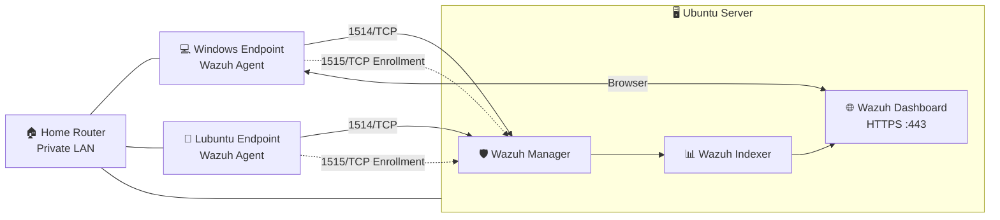
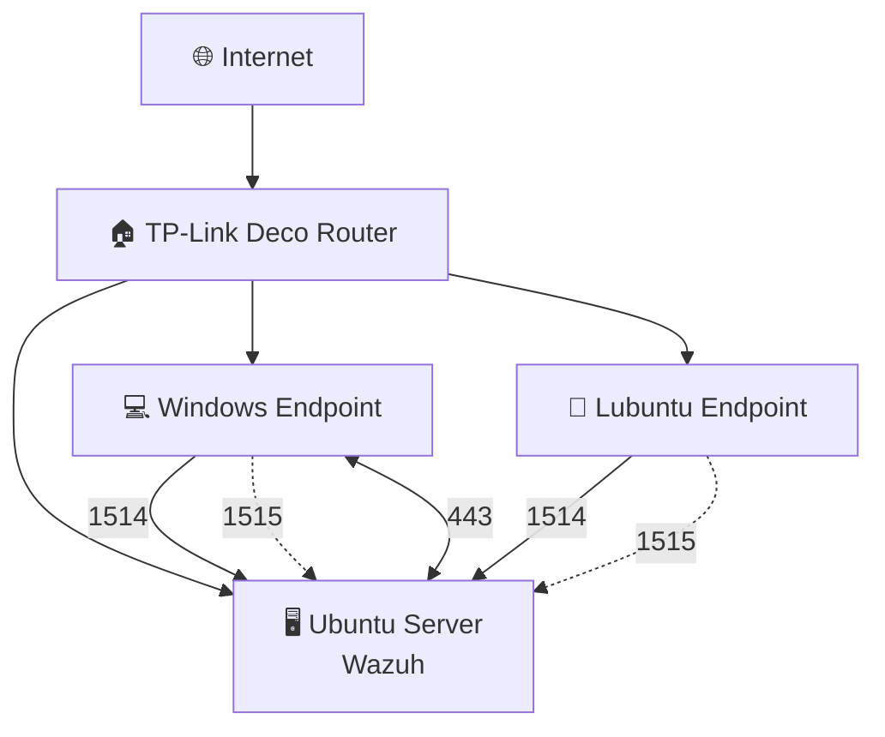
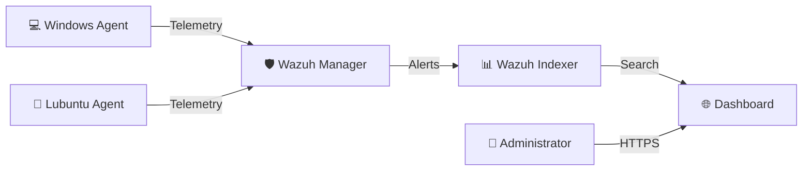
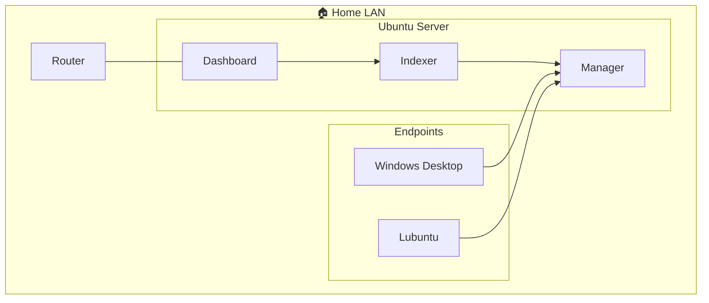

  <h1 align="center" style="text-decoration: none; border-bottom: none;">SIEM and XDR on Homelab</h1>

  

    Using <strong>Wazuh</strong> as a <strong>SIEM and XDR </strong>solution for my homelab.
     
     
     
  

<!-- TABLE OF CONTENTS -->

  
Table of Contents

  <ol>
      <li>
        <a href="#project-overview">Project Overview</a>
      </li> 
      <li> 
        <a href="#lab-architecture">Lab Architecture</a>
        <ul>
          <li><a href=#network-topology">Network Topology</a></li>
          <li><a href=#data-flow">Data Flow</a></li>
          <li><a href=#homelab-infrastructure">Homelab Infrastructure</a></li>
        </ul>
      </li>
      <li>  
        <a href="#why-i-built-this">Why I Built This</a>
      </li>
      <li>  
        <a href="#technologies">Technologies</a>
      </li>
      <li>  
        <a href="#hardware">Hardware</a>
      </li>
      <li>  
        <a href="#network-layout">Network Layout</a>
      </li>
      <li> 
        <a href="#server-installation">Server Installation</a>
      </li>
      <li>  
        <a href="#wazuh-installation">Wazuh Installation</a>
      </li>
      <li>
        <a href="#client-enrollment">Client Enrollment</a>
      </li>
      <li>  
        <a href="#dashboards">Dashboards</a>
      </li>
      <li>
        <a href="#detection-capabilities">Detection Capabilities</a>
      </li>
      <li>  
        <a href="#useful-commands">Useful Commands</a>
      </li>
      <li>  
        <a href="#future-improvements">Future Improvements</a>
      </li>
      <li>
        <a href="#learning-journey">Learning Journey</a>
      </li>
    </li>
  </ol>

<!-- Project Overview -->
## Project Overview
<strong>A self-hosted Security Operations Center (SOC) homelab built using <strong>Ubuntu Server</strong> and <strong>Wazuh SIEM/XDR</strong> to centralize endpoint monitoring, security event analysis, and system visibility across a local network.</strong>

This repository documents my journey into cybersecurity through the design, deployment, and continuous improvement of a personal homelab environment. By repurposing an Ubuntu server as the central security platform and enrolling Windows endpoints as monitored agents, this project serves as a practical environment for learning enterprise security operations, endpoint detection and response (EDR/XDR), log management, and threat monitoring.

This homelab emphasizes understanding how modern Security Operations Centers operate, from collecting telemetry and monitoring endpoint activity to analyzing security events and managing multiple systems from a centralized dashboard. As the project evolves, additional security tools and defensive technologies will be integrated to simulate a more complete Blue Team environment while remaining entirely self-hosted within a local area network.

<!-- Lab Architecture -->
## Lab Architecture
<strong>Key Architectural Highlights</strong>

* **Centralized Security Monitoring:** A dedicated Ubuntu Server hosts the Wazuh Manager, Indexer, and Dashboard, providing a single platform for monitoring all enrolled endpoints.
* **Endpoint Detection & Response (XDR):** Windows client machines are enrolled as Wazuh agents, continuously reporting system events, inventory, vulnerabilities, and security telemetry back to the server.
* **Local-Only Infrastructure:** The entire environment operates exclusively within a private LAN, minimizing external attack surface while providing a realistic enterprise-style deployment.
* **Hands-On Cybersecurity Learning:** Designed as a practical lab for studying SIEM technologies, Linux server administration, Windows endpoint management, network security, and defensive operations.
* **Scalable Architecture:** Built with future expansion in mind, allowing additional Windows and Linux endpoints, Sysmon, Suricata IDS, Sigma rules, Active Response, and other security tools to be integrated over time.

### Network Topology

### Data Flow

### Homelab Infrastructure

<!-- Why I Built This -->
## Why I Built This

<!-- Technologies -->
## Technologies

<!-- Hardware -->
## Hardware

<!-- Network Layout -->
## Network Layout

<!-- Server Installation -->
## Server Installation

<!-- Wazuh Installation -->
## Wazuh Installation

<!-- Client Enrollment -->
## Client Enrollment

<!-- Dashboards -->
## Dashboards

<!-- Detection Capabilities -->
## Detection Capabilities

<!-- Useful Commands -->
## Useful Commands

<!-- Future Improvements -->
## Future Improvements

<!-- Learning Journey -->
## Learning Journey
